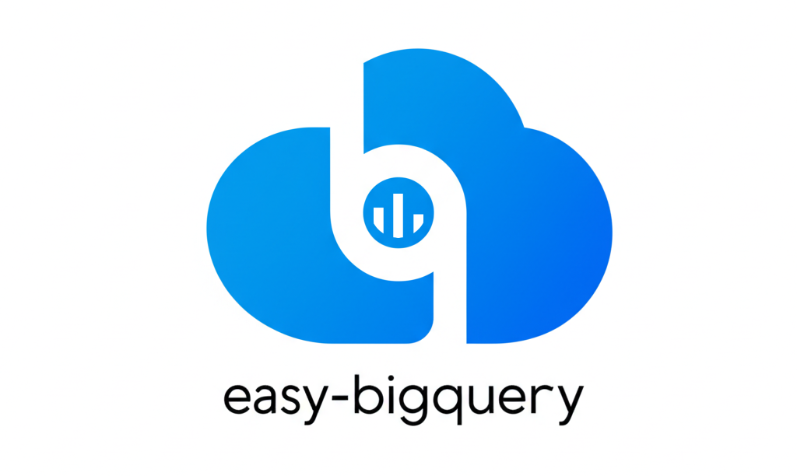

# Easy Bigquery

{widht:500 .center}

## Overview

**Easy BigQuery** is a Python package designed to simplify interactions with Google BigQuery. It provides a high-level API for connecting, fetching, and pushing data, allowing you to focus on your data analysis instead of boilerplate code.

## Key Features

- **Simplified Connection**: Connect to BigQuery with minimal configuration.
- **Efficient Data Fetching**: Fetch data using the BigQuery Storage API for high-speed downloads.
- **Easy Data Pushing**: Push pandas DataFrames to BigQuery with a single command.
- **Context Management**: Automatic handling of client sessions and connections.
- **Clear Logging**: Built-in logging for better traceability.

## Installation

You can install **Easy BigQuery** using `pip`, `poetry`, or directly from the source.

### Using pip

```bash
pip install easy-bigquery
```

### Using Poetry

```bash
poetry add easy-bigquery
```

### From Source

```bash
git clone https://github.com/AndreAmorim05/easy-bigquery.git
cd easy-bigquery
poetry install
```

## Configuration

To use **Easy BigQuery**, you need to set up your environment variables. Create a `.env` file in your project's root directory with the following content:

```env
# BigQuery
BQ_PROJECT_ID=your-gcp-project-id
BQ_DATASET=your-bigquery-dataset
BQ_TABLE_NAME=your-bigquery-table
BQ_JSON_CREDENTIALS='{ "type": "service_account", ... }'
```

Replace the placeholder values with your actual GCP project information.

## Tutorial

This tutorial will guide you through the main features of **Easy BigQuery**.

### Using the Context Manager (Recommended)

The `BQManager` class is the recommended way to interact with BigQuery. It simplifies connection management by handling the connection lifecycle automatically.

```python
import pandas as pd
from easy_bigquery import BQManager

# External table
TABLE_ID = 'bigquery-public-data.usa_names.usa_1910_current'

# Internal table
PROJECT_ID = 'your-gcp-project-id'
DATASET = 'your-bigquery-dataset'
TABLE_NAME = 'your-bigquery-table'

# Using the Manager as a context manager handles all
# connection and disconnection logic automatically.
with BQManager() as bq:
    # 1. Fetch data from a public dataset.
    sql = f'SELECT * FROM `{TABLE_ID}` LIMIT 15'
    data = bq.fetch(sql)
    print(data.head())

    # 2. Push a new DataFrame to your dataset.
    bq.push(
        df=df_to_push,
        project_id=PROJECT_ID,
        dataset=DATASET,
        table=TABLE_NAME,
        write_disposition='WRITE_APPEND',
    )
```

### Manual Connection Management

While the context manager is recommended, you can also manage the connection manually. This approach is useful if you need more control over the connection lifecycle.

#### Connecting to BigQuery

The `BQConnector` class manages the connection to BigQuery. You can use it to manually control the connection lifecycle.

```python
from easy_bigquery import BQConnector

# The connector is instantiated but not yet connected.
connector = BQConnector()

try:
    # Manually establish the connection.
    connector.connect()
    print(f'Client is active: {connector.client is not None}')

    # Now you can pass this 'connector' instance to a
    # Fetcher or Pusher class for operations.

finally:
    # Always ensure the connection is closed.
    connector.close()
```

#### Fetching Data

The `FetchWorker` class allows you to fetch data from BigQuery and load it into a pandas DataFrame.

```python
from easy_bigquery import BQConnector
from easy_bigquery.workers import FetchWorker

sql = 'SELECT name, state FROM `bigquery-public-data.usa_names.usa_1910_current` LIMIT 5'
connector = BQConnector()
try:
    connector.connect()
    # The worker needs an active connector to work.
    worker = FetchWorker(connector)
    df = worker.fetch(sql)
    print('Fetched DataFrame:')
    print(df)
finally:
    connector.close()
```

#### Pushing Data

The `PushWorker` class allows you to push a pandas DataFrame to a BigQuery table.

```python
import pandas as pd

from easy_bigquery import BQConnector
from easy_bigquery.workers import PushWorker

# Create a sample DataFrame to upload.
data = {'product_id': [101, 102], 'product_name': ['Gadget', 'Widget']}
df_to_push = pd.DataFrame(data)

connector = BQConnector()
try:
    connector.connect()
    # Define the destination table.
    table_name = 'test_table'

    # The worker needs an active connector.
    worker = PushWorker(connector)
    worker.push(
        df=df_to_push,
        project_id=connector.project_id,
        dataset=connector.dataset,
        table=table_name,
        write_disposition='WRITE_TRUNCATE',
    )
    print(f'Successfully pushed data to {table_name}')
finally:
    connector.close()
```

# Contributing to Easy BigQuery

Thank you for considering contributing! We welcome improvements, bug fixes, tests, and documentation. Please read below to understand how to get involved.


## Getting Started

1. **Fork** this repository and clone your fork locally.
2. Create a new branch for your work:
   ```bash
   git checkout -b feature/my-feature
   ```
4. Make your changes in the new branch.

## Pull Request Guidelines

When submitting a PR, please follow these conventions:

- **Title**:
    ```
    type(scope): short description
    ```
    Examples:
    - `fix(query): handle empty string columns`
    - `feat(schema): support clustering configuration`
    - `docs: update usage examples`

- **PR Body**:
    ```
    ### Description (REQUIRED)

    <!-- brief description of what this PR does -->

    ### Related Issues (Optional)

    <!-- referenced issues (e.g., `Closes #12`) -->

    ### Additional notes (Optional)

    <!-- any additional context -->
    ```

## How You Can Contribute

We welcome contributions such as:

- Reporting reproducible bugs via [GitHub Issues](https://github.com/yourorg/easy-bigquery/issues)
- Submitting new features or enhancements
- Improving test coverage
- Improving or clarifying documentation
- Reviewing existing pull requests

## PR Checklist

Before you submit, please confirm:

 - [ ] You have read the contribution guidelines
 - [ ] You have tested the changes locally
 - [ ] You have updated the documentation where needed
 - [ ] You have described what this PR does
 - [ ] You have ensured my changes do not break existing functionality
 - [ ] You have added any new dependencies to `requirements.txt` or `pyproject.toml`
 - [ ] You have checked for any merge conflicts
 - [ ] You have ensured my code is compatible with Python 3.13+
 - [ ] You have ensured my code is compatible with the latest version of BigQuery
 - [ ] You have ensured my code is compatible with the latest version of Google Cloud SDK
 - [ ] You have ensured my code is compatible with the latest version of Google Cloud Python libraries
 - [ ] You have ensured my code is compatible with the latest version of Google Cloud BigQuery API

## Questions?

If you have questions or need guidance, please open an issue or discuss with us via GitHub. We are happy to help!

## License

This project is licensed under the MIT License. See the [LICENSE](LICENSE) file for details.
